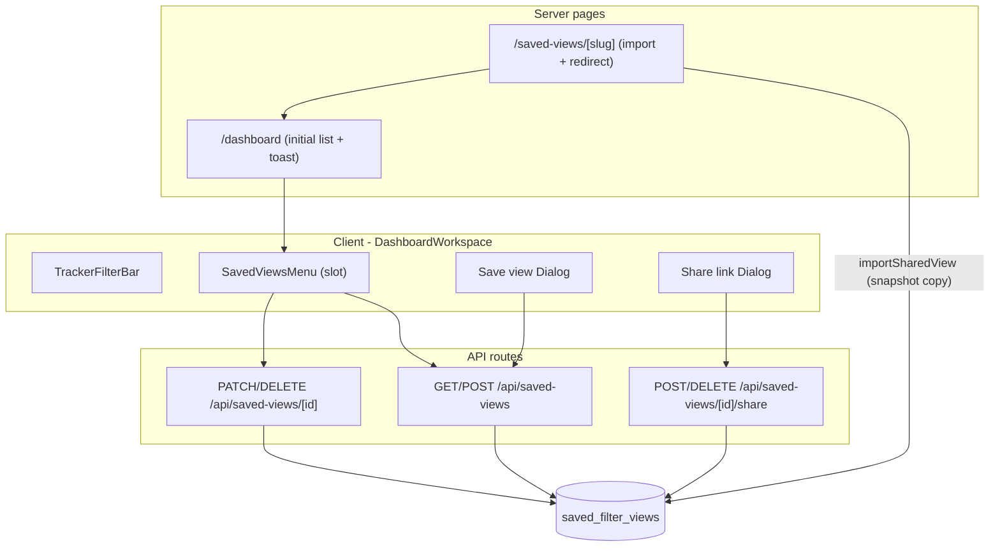

# Saved Views: named, shareable filter presets

## Overview

Saved views = named filter presets that snapshot a subset of `GridFiltersJson` plus preferred view mode, surfaced from a new dropdown in `TrackerFilterBar`. Sharing is link-based with snapshot semantics: opening a share link inserts a copy into the recipient's row set under "Shared with you" (no live reference, no propagation of later edits).

## Terminology / collision note

The existing `views` table holds *tracker panels*, which is a different concept. To avoid confusion the new table is named `saved_filter_views`; user-facing label is just "Views" (or "Saved views"). Existing `?f=base64url(JSON)` share button in [src/components/workspace/share-filter-link-button.tsx](src/components/workspace/share-filter-link-button.tsx) stays as-is — it's the ephemeral "share my current filters" path, distinct from saved-view sharing.

## Saved payload shape

Per your selection: exclude `class` and `search`; include `viewMode`. The saved payload is a strict subset of `GridFiltersJson` plus a separate column for mode.

```ts
// src/lib/saved-views/schema.ts (new)
SavedFilterViewPayload = {
  version: 1,
  setHashes: number[],
  archetypeHashes: number[],
  tuningHashes: number[],
  tertiaryStats: ArmorStatName[],
}
// view_mode: "grid" | "table"   ← stored in its own column
```

Applying a view = `onFiltersChange({ ...current, ...payload })` (so current `class` and `search` are preserved) + `setMode(view.view_mode)`.

## Data model — `supabase/migrations/0015_saved_filter_views.sql` (new)

```sql
create table public.saved_filter_views (
  id uuid primary key default gen_random_uuid(),
  user_id uuid not null references public.users(id) on delete cascade,
  name text not null check (char_length(name) between 1 and 80),
  filters jsonb not null,                 -- SavedFilterViewPayload
  view_mode text not null check (view_mode in ('grid','table')),
  share_slug text,                        -- null until owner generates a link
  source_user_id uuid references public.users(id) on delete set null,
  source_display_name text,               -- frozen at import time
  source_share_slug text,                 -- which slug this snapshot came from (idempotent imports)
  created_at timestamptz not null default now(),
  updated_at timestamptz not null default now()
);

create index saved_filter_views_user_id_idx on public.saved_filter_views(user_id);
create unique index saved_filter_views_share_slug_uidx
  on public.saved_filter_views(share_slug) where share_slug is not null;
create unique index saved_filter_views_user_source_slug_uidx
  on public.saved_filter_views(user_id, source_share_slug) where source_share_slug is not null;

alter table public.saved_filter_views enable row level security;  -- service-role only, like every other table
```

Categorization in UI is purely a derived field: `source_user_id is null` → "Saved by you"; otherwise → "Shared with you".

Update [src/lib/db/types.ts](src/lib/db/types.ts) by adding `saved_filter_views` to the `Database` type and exporting `SavedFilterViewRow`.

## Server logic — `src/lib/saved-views/` (new)

- `schema.ts` — Zod for `SavedFilterViewPayload`; helpers `payloadFromGridFilters(filters)` (drops `class` + `search` + `version` rewrite) and `applyPayloadToGridFilters(current, payload)`.
- `queries.ts` — service-role helpers, mirroring the pattern in [src/lib/views/queries.ts](src/lib/views/queries.ts):
  - `listSavedViewsForUser(userId)` — owned + snapshots, ordered by name.
  - `createSavedView(userId, { name, filters, viewMode })`
  - `renameSavedView(userId, id, name)`
  - `deleteSavedView(userId, id)` — works for both owned and snapshots (snapshot delete = remove from your list).
  - `ensureShareSlug(userId, id)` — generates a `share_slug` if absent (random 12-char base32; retry on conflict). Owner-only.
  - `revokeShareSlug(userId, id)`
  - `importSharedView(recipientUserId, slug)` — looks up source by slug; if recipient already has a row with `(user_id=recipientUserId, source_share_slug=slug)` returns it; otherwise copies `name`/`filters`/`view_mode` and sets `source_user_id`/`source_display_name`/`source_share_slug`. Idempotent.

## API routes — `src/app/api/saved-views/`

All require session via `getSessionFromRequest(req)` and use `getServiceRoleClient()` with explicit `.eq("user_id", session.userId)` (matching the existing `views` API in [src/app/api/views/route.ts](src/app/api/views/route.ts) and [src/app/api/views/[id]/route.ts](src/app/api/views/[id]/route.ts)).

- `GET /api/saved-views` — list.
- `POST /api/saved-views` — `{ name, filters, viewMode }`. Validate via `savedFilterViewPayloadSchema`.
- `PATCH /api/saved-views/[id]` — `{ name }` only in v1 (rename). Owner-only.
- `DELETE /api/saved-views/[id]` — delete owned view or remove snapshot from list.
- `POST /api/saved-views/[id]/share` — owner-only; returns `{ slug, url }` from `ensureShareSlug`.
- `DELETE /api/saved-views/[id]/share` — owner-only; clears slug.

Mutating routes call `crossSiteOriginBlockResponse(req)` like the existing routes do.

## Share-link landing — `src/app/saved-views/[slug]/page.tsx` (new)

Server component. Top-level path chosen to avoid the `/views/[id]` dynamic-segment collision.

1. `getSession()` — if no session, redirect to `/?returnTo=/saved-views/<slug>` (same pattern as the existing share flow in [src/app/dashboard/page.tsx](src/app/dashboard/page.tsx)).
2. `importSharedView(session.userId, slug)`:
  - 404 if slug doesn't exist (or has been revoked).
  - Returns existing snapshot row if recipient already imported, else inserts.
3. `redirect("/dashboard?savedViewImported=<row.id>")`.

`/dashboard` reads `?savedViewImported=<id>`, applies that view's filters + mode on first render, and shows a `sonner` toast: "Shared by ".

## UI

### New: `src/components/workspace/saved-views-menu.tsx`

`DropdownMenu` (reusing [src/components/ui/dropdown-menu.tsx](src/components/ui/dropdown-menu.tsx)). Trigger label = active view name (when one is selected) or "Views". Content:

- Section "Saved by you" — owned rows. Per-row hover actions: Apply (entire row click), kebab menu → Rename, Get share link, Revoke share link, Delete.
- Section "Shared with you" — snapshot rows, suffix "from ". Per-row: Apply (click), Delete (= remove from list). No rename/share for snapshots in v1.
- Footer item: "Save current filters as view…" — opens save dialog.
- Empty state per section.

Two small `Dialog` components (reusing [src/components/ui/dialog.tsx](src/components/ui/dialog.tsx)):

- **Save view** — name input → `POST /api/saved-views`.
- **Share link** — shows the URL with a "Copy" button and a "Revoke link" action. `POST /api/saved-views/[id]/share` lazily on open.

### Modified: `src/components/workspace/tracker-filter-bar.tsx`

Add an optional `savedViewsSlot?: ReactNode` prop, rendered immediately after the class-tabs vertical divider (the explore agent's recommended insertion point — before Sets). No other changes to filter bar internals.

### Modified: `src/components/dashboard/dashboard-workspace.tsx`

- Owns saved-views state. Fetch initial list on the server in `dashboard/page.tsx` and pass as prop, then keep an in-memory cache and revalidate on mutations.
- Computes `activeSavedViewId` by comparing current `filters` (excluding class/search) + `mode` against each saved view (deep equality on the small payload).
- Builds the `SavedViewsMenu` element (with apply/save/rename/share/delete handlers wired) and forwards it as `savedViewsSlot` through `GridWorkspace` and `InventoryTableView` (both already render `TrackerFilterBar`).
- Apply handler: `onFiltersChange(applyPayloadToGridFilters(filters, view.filters))` + `setMode(view.view_mode)`.

### Modified: `src/app/dashboard/page.tsx`

- Add server-side fetch of saved views (`listSavedViewsForUser`).
- Read `?savedViewImported=<id>` to trigger the toast on the client.
- The existing `?f=` share-link logic is untouched.

## Architecture diagram




## Behaviors not implemented in v1 (deferred)

- Editing filter contents of an existing saved view (workaround: delete + save current filters under same name). Keeps API surface tight.
- Recipients re-sharing snapshots they received (the `share_slug` column allows it later, but UI doesn't expose it).
- Public/anonymous viewing of share links — login is required (matches the existing `?f=` flow).
- Telemetry / analytics.

## Storybook

Add `src/components/workspace/saved-views-menu.stories.tsx` using the existing mock conventions in `.storybook/mocks/` (mock owned + shared rows, empty state, dialog open states). Run `npm run test-storybook` after.

## Verification

- `npm run lint` clean.
- `npm run build` clean (TypeScript strict).
- `npm run db:push:dry-run` shows only `0015_saved_filter_views.sql` pending; then `npm run db:push`.
- Manually: save view from current filters → appears in "Saved by you" → apply from Tracker mode (mode + filters set) → switch to Table → tertiary still applied → generate share link → open in incognito (different account) → snapshot lands in "Shared with you" with original creator's display name → delete from recipient leaves owner's view intact → revoke link from owner makes the URL 404 for new recipients but existing snapshots persist.

